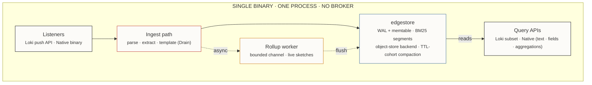
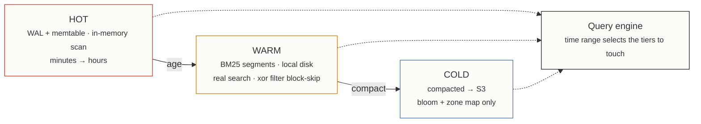
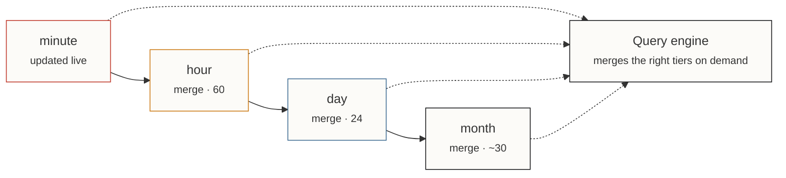

# Pierre

**Product Requirements — working name**

| | |
|---|---|
| **Status** | Draft |
| **Version** | 0.1 |
| **Owner** | Gleicon |
| **Date** | 2026-07-03 |
| **Engine** | edgestore (Rust) |
| **Deploy unit** | 1 static binary |

> A single-binary log indexer that puts real search, tiered storage, and pre-computed aggregations on cheap object storage — sized for the apps that don't need a 20-node cluster.

---

## 01 · Summary

Most log platforms are built for someone else's scale. You adopt Elasticsearch, OpenSearch, or Splunk and inherit the operational weight of a distributed system — nodes, shards, JVMs, index lifecycle management — to serve a workload doing 100 requests per second.

Pierre is a log indexer for that workload and roughly 10× its headroom. One process, one binary, embedded storage. It keeps a real full-text index where recent data lives, ages data down to compacted object storage on a schedule you set, and answers filter-and-range queries plus pre-computed aggregations without spinning up a query cluster. It speaks just enough of the Loki protocol to be a drop-in behind existing collectors, and exposes a native path for its own shipper.

The storage engine is **edgestore** — an SSD-aware, append-only embedded database already carrying the WAL, LSM segments, BM25 full-text index, object-storage backend, and TTL-cohort compaction this product needs. Pierre is the ingest, query, and rollup layer on top of it, not a new storage system.

---

## 02 · Problem

- **The elastic tax.** Cluster-native log stores charge — in machines and in operator time — for elasticity most single-app deployments never use.
- **Loki gets the economics right but punts on search.** Label-sharded chunks on object storage are cheap, but there's no inverted index on message content, so anything past label matching becomes a brute-force scan.
- **ELK/Splunk get search right but index everything.** Full indexing at rest is why they're expensive to keep.
- **Aggregations are recomputed on read.** "p99 latency by endpoint over the last week" rescans raw data every time it's asked, instead of being maintained as data arrives.

Nobody occupies the middle: real search on recent data, cheap storage for old data, aggregations computed once — in a single deployable unit.

---

## 03 · Goals & non-goals

**Goals**

- Single static binary, no external services in the data path.
- Real full-text search on hot/warm data via edgestore BM25.
- Tiered storage: memory → local disk → object storage, aged by policy.
- Pre-computed, mergeable aggregations at minute→month granularity.
- Drop-in behind existing collectors via the Loki push API.
- Retention as a first-class operation, not a cron job.

**Non-goals**

- Full LogQL — no metric queries, no `rate()` / `sum by()` planner.
- Every collector protocol. Two listeners, not five.
- Horizontal cluster with rebalancing and consensus.
- Multi-tenant isolation and RBAC (v1).
- Exact analytics where an approximation is honest and bounded.

---

## 04 · Architecture

Everything runs in one process. Protocol listeners are async tasks that parse their wire format into one shared record type and hand off to a common ingest path. There is no message broker between ingest and storage — edgestore's WAL is the durability boundary that would otherwise justify Kafka. Compaction, TTL expiry, and tiering to object storage are edgestore background tasks in the same process. The two query surfaces are HTTP routers over the same in-process store handle.



*Fig 1. Solid = ingest & query. Dashed = async rollup, off the hot path.*

---

## 05 · Storage model

edgestore already is the three tiers. Pierre configures their boundaries and encodes time into the key prefix so a range scan doubles as a time-range query — no separate time index.



*Fig 2. A `-1h` query never reads cold storage. Search fidelity is highest where queries are hottest.*

| Tier | Backing | Index | Purpose |
|---|---|---|---|
| `hot` | WAL + memtable | field scan | durable fast path, no disk I/O on write |
| `warm` | local SSD segments | BM25 + xor filter | real full-text on recent data |
| `cold` | object storage | bloom + zone map | cheap retention, block-level skip |

Cold makes the same trade Loki does — but *deliberately*, at a boundary you choose, while warm still gives real search for anything recent enough to matter operationally.

---

## 06 · Ingest

Two listeners in v1. Each is an async task that normalizes to one internal record; adding a protocol later is a parser, not a service.

- **Loki push API** — covers Promtail, Alloy, Vector, and Fluent Bit's Loki output with zero pipeline changes. Highest leverage, so it's first.
- **Native binary** — framed batch straight into edgestore's write path, skipping generic-format parsing, for Pierre's own shipper.

At ingest each line gets structured/unstructured detection, a small set of typed fields extracted into a columnar side-index (`level`, `status`, `trace_id`, `latency_ms`), and a Drain-style `template_id`. That template id is reused everywhere downstream — full-text, top-K rollups, and any future similarity layer — so templating is paid for once.

**Deferred:** Fluent Forward, syslog, OTLP. Each is a distinct wire format with its own edge cases and ongoing maintenance surface. Added only when a real user can't switch their agent's output.

---

## 07 · Query

A terse surface, deliberately. The features that make LogQL expensive are exactly the ones cut.

- **Selectors + time range** — label and field predicates hit the columnar index; the time range picks the tiers.
- **Line filter** — grep-equivalent, backed by BM25 on warm, bloom-filtered scan on cold.
- **Aggregation reads** — served from pre-computed sketches (§08), never by rescanning raw lines.
- **No metric query engine** — no `rate()`, no `sum by()` over arbitrary windows. That planner is the costly part of LogQL and buys little for this workload.

The Loki-compatible surface targets what Grafana's Explore view and typical dashboards actually generate, and is honest about not chasing full parity.

---

## 08 · Pre-computed aggregations

Aggregations are maintained as data arrives, using probabilistic structures chosen per field type. Everything here is **algebraically mergeable**: compute at minute granularity on ingest, and every coarser tier is an `O(N)` merge of the tier below, not a recomputation. Memory is bounded by config, not by traffic.

| Field shape | Example | Structure | Why |
|---|---|---|---|
| low-cardinality categorical | `status`, `level` | exact counter | ~60 values; approximating buys nothing |
| high-cardinality, uniqueness | `user_id`, `ip` | HyperLogLog | ~4–16 KB regardless of unique count |
| unbounded, frequency | `path`, `template_id` | Space-Saving / CMS | top-K without tracking every value |
| numeric | `latency_ms` | DDSketch | relative-error p50/p95/p99, *exact* merges |

DDSketch over t-digest specifically: merges run constantly up the hierarchy, and t-digest's merge is itself lossy and compounds; DDSketch's log-bucket histogram merges exactly.



*Fig 3. A month's DDSketch is the same size as a minute's — bounded by precision, not by data volume. Coarse tiers cost almost nothing to keep.*

### The async path

Rollups never block ingest. The ingest path does its normal edgestore write, then a non-blocking `try_send` of just the configured fields into a bounded channel. If the channel is full, drop and increment a counter — approximate data should degrade in precision under pressure, not cost throughput. A single consumer drains the channel into the live minute bucket. On each wall-clock-aligned minute (plus a few-second grace window for stragglers), the live set is swapped for a fresh one and the retired set is serialized into edgestore with the field's TTL. Hour/day/month jobs run on their own timers, merging already-persisted tiers.

**Durability trade, stated explicitly:** the unflushed minute bucket lives only in memory; a crash loses up to ~1 minute of contribution to one rollup tier, on data that is approximate by design. Raw logs are unaffected — they go through the WAL regardless. Rollup deltas are intentionally *not* WAL'd; the complexity isn't worth a bounded, self-healing error.

### Config

```toml
# pierre.toml — declarative, no DSL

[[rollup]]
field         = "status"
kind          = "exact"
granularities = ["1m", "1h", "1d"]

[[rollup]]
field         = "user_id"
kind          = "hll"
granularities = ["1h", "1d", "1mo"]

[[rollup]]
field         = "template_id"   # reuses Drain extraction
kind          = "topk"
k             = 20
granularities = ["1m", "1h", "1d"]

[[rollup]]
field             = "latency_ms"
kind              = "ddsketch"
relative_accuracy = 0.01
granularities     = ["1m", "1h", "1d", "1mo"]
```

Rust crates: `hyperloglogplus`, `sketches-ddsketch`; Space-Saving is a bounded map with eviction, small enough to own directly.

---

## 09 · Retention

Retention rides edgestore's `put_with_ttl` and deathtime-cohort compaction, which cohorts data that expires together so compaction stops rewriting live data next to dying data — driving write amplification toward 1.0. Logs have exactly the clean "dies together" signal (a time bucket) that general-purpose LSM engines can't assume. Retention is a property of the write, not a periodic delete-and-hope job. Each rollup tier gets its own TTL: minute sketches hours, hour sketches weeks, month sketches effectively forever — coarse tiers are tiny.

---

## 10 · Out of scope · v2 candidates

- **Template similarity search (HNSW).** Already in edgestore; embed one vector per template for "find similar errors" / anomaly clustering. Cut from v1 because it costs CPU per line for a feature nobody has asked for yet. Free to add later, not free to run by default.
- **Additional collectors.** Fluent Forward, syslog, OTLP — demand-driven.
- **Metric-query LogQL.** Only if dashboards genuinely need server-side windowed rates.
- **Multi-node.** Read replicas over shared object storage before anything resembling consensus.

---

## 11 · Success criteria

- Sustains 10× the 100 req/s baseline on a single modest node with headroom.
- Full-text query over the warm window returns in interactive time (sub-second target).
- Aggregation reads are served from sketches — constant-time in the raw data volume behind them.
- Steady-state cost is dominated by object storage, not compute.
- Drops in behind an existing Promtail/Alloy/Vector pipeline with only an endpoint change.

---

# Appendix A · edgestore improvements

These are engine-level capabilities that would make Pierre cleaner, but whose value is **general** — they belong in edgestore because any user doing time-series, analytics, or materialized views benefits, not just this project. Kept out of the Pierre scope above precisely because they're upstream work.

### ENG-1 · Merge operators on values

A trait letting a value type define how two values under the same key combine, invoked during compaction (RocksDB-style merge operators). Pierre would register sketch merges and let the engine fold co-keyed rollups automatically instead of read-modify-write in app code.

*Also benefits:* counters, CRDTs, any accumulating value — a broadly requested LSM primitive.

### ENG-2 · Native time-partitioned keyspace

First-class support for a designated timestamp dimension: time-bucketed segments with zone maps on that field, so range-by-time is a native concept rather than a key-encoding convention each caller reinvents.

*Also benefits:* every event-store, metrics, and audit-log workload on edgestore.

### ENG-3 · Predicate pushdown on scans

A scan API that accepts filter predicates and evaluates them against xor filters and zone maps before materializing blocks, so callers skip decompressing segments that can't match. Pierre's line filters and field selectors ride this directly.

*Also benefits:* anyone running selective reads over large segment sets.

### ENG-4 · Public k-way compaction merge iterator

Expose the merge iterator compaction already uses, so users can build materialized views and custom rollups that run *as* compaction happens rather than as a separate pass over the same data.

*Also benefits:* any downstream materialization — secondary indexes, dedup, derived aggregates.

### ENG-5 · Tiering lifecycle hooks

A policy interface over the `StorageBackend` trait to control when a segment moves hot→warm→cold and which index structures survive each transition (e.g. drop the inverted index shipping to object storage, keep bloom + zone map). Pierre's tier boundaries become configuration instead of forked engine code.

*Also benefits:* any deployment mixing local SSD and object storage under a cost policy.

### ENG-6 · Typed columnar secondary index

A first-class low-cardinality columnar index on extracted fields, distinct from the full-text index — bounded-cardinality categorical lookup without paying inverted-index cost. Pierre's field side-index becomes an engine feature.

*Also benefits:* faceted search and any structured-field filtering on top of documents.

---

*Pierre · PRD v0.1 · working name · engine: edgestore*